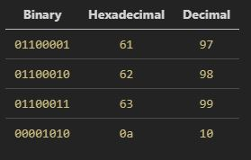
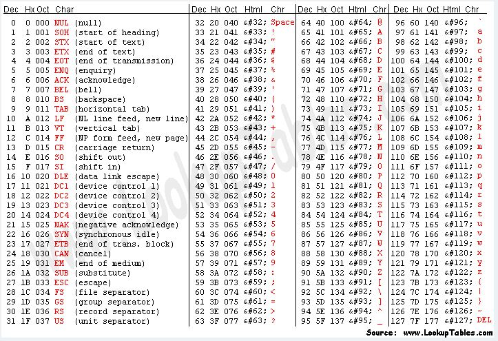
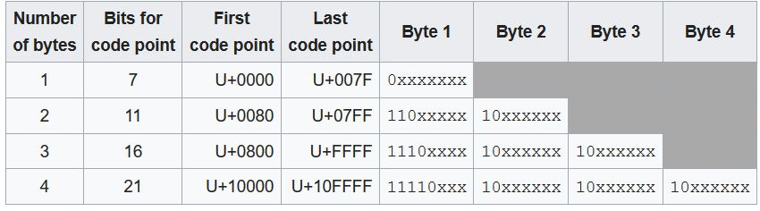
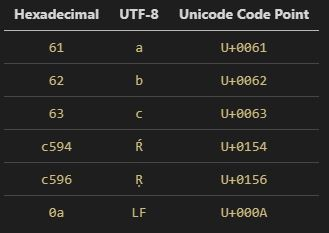
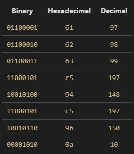

# Data
* We will use the following 4 terms as a starting point: __character__, __number__, __numeral system__, and __physical representation on disk__. These will serve as the "atomic units" of understanding how data is transformed on a computer.
    * __character__
        * A set of __characters__ is the representation of any given language's alphabet. The english alphabet has 26 characters for example.
    * __number__
        * A number seems pretty straightforward, but it's actually an abstract concept. What is the number for how many fingers you have? You could say it's `1010`, `10`, or `a` and all 3 would be accurate! Why? Because of __numeral systems__.
    * __numeral system__
        * This is peeling back a layer of abstraction on __numbers__. Turns out there are an arbitrary number of ways to represent a __number__! Getting kind of inceptiony here, but the concept of radix/base comes into play here. A radix of 10 (also known as base-10) is what we commonly know as decimal. There's also hexadecimal (base-16), binary (base-2), etc...
    * __physical representation on disk__
        * This is about how to represent data. Data is an abstract concept. If you peel back enough layers, all data on a computer system is represented using the binary numeral system. This is what we'll define as the __physical representation on disk__.
* __encoding__
    * Now let's define what we mean by the use of __encoding__ in this document. An encoding is the mapping of one of our atomic units to another atomic unit. So we can think of an encoding as a function: `f(atomic unit) -> atomic unit`.
    * However, there is an ordering to these atomic units. Let's explore this ordering and how it relates to __encoding__.
    * The term __encoding__ is used quite broadly in the software industry. We will attempt to disambiguate the term a bit and provide some more granular definitions of the types of __encodings__ out there and how they relate to our 4 atomic units.
* Unicode --- The set of all __characters__
    * Unicode is not an encoding. It is a __character set__ (a grouping of __characters__). It is the standardized way to represent ["every reasonable writing system on the planet."](https://www.joelonsoftware.com/2003/10/08/the-absolute-minimum-every-software-developer-absolutely-positively-must-know-about-unicode-and-character-sets-no-excuses/) You can think of it as the world's largest alphabet. The Unicode __character set__ is represented using a concept known as code points. Every letter maps to a code point, which is represented something like this: `U+0041`. That is the english letter `A` (which has a different code point than `a`).
* Transforming a __character__ into a __number__
    * Now enter the different __character encodings__ (e.g., ASCII, ANSI, UTF-8, UTF-16, UTF-32, etc...). This is what we will call how we encode a __character__ into a __number__.
    * each character encoding has alphabets. when ascii doesn't understand something it uses that question mark box
    * ASCII and ANSI are old and can't represent Unicode. [UTF-8, UTF-16, and UTF-32](https://stackoverflow.com/questions/496321/utf-8-utf-16-and-utf-32) do however.
* Transforming a __number__ into a __numeral system__
    * Now enter the different __numeric encodings__ (e.g., Binary, Octal, Decimal, Hexadecimal, Base64, etc...). This is how we encode a __number__ into a __numeral system__ representation,
    * Any __character encoding__ from any of those aforementioned encodings can be represented by any of these __numeral systems__.
    * The UTF-8 encoding for [TETRAGRAM FOR STOVE](https://www.fileformat.info/info/unicode/char/1d331/index.htm) is `0xf09d8cb1` in hexadecimal, etc...
    * start with TETRAGRAM FOR STOVE and work your way through the flowchart
    * numeral system has alphabets
    * encoding requires a character encoding and a numeral encoding to be able to be represented? otherwise in a state of flux, it is a arbitrary concept. a character needs acsii, ansi, etc... to be represented as a number. a number needs binary, octal, etc... to be understood by a computer
* Final step: going from __numeral system__ to __physical representation on disk__
    * Remember __physical representation on disk__? It's the final state for our data. As we mentioned, it's binary (the binary __numeral system__ to be exact).
    * There is no "encoding" left here. We just convert whatever base we were in to binary and voila! If we were already in binary, then there was literally nothing to do.
* State ASCII art: __character__ -> __number__ -> __numeral system__ -> __physical representation on disk__
* 
* Base64
    * [Base64 vs. Base64URL](http://websecurityinfo.blogspot.com/2017/06/base64-encoding-vs-base64url-encoding.html)
        * URL encoding transforms a string into a valid URL.
        * Base64URL doesn't use `+` or `/` characters (instead using `-` and `_`) to make it URL and filesystem safe.
* [Padding](https://stackoverflow.com/questions/4080988/why-does-base64-encoding-require-padding-if-the-input-length-is-not-divisible-by)
    * Bit size
        * Base<sub>2</sub> has an alphabet size of 2, and therefore requires 1 bit to represent (i.e., `0` or `1`). 2<sup>1</sup> == 2.
            * 1 byte can hold 8 characters:
            ```
            1 byte / bit-size ---> 8 bits / bit-size ---> 8 / 1 ---> 8
            ```
        * Base<sub>16</sub> has an alphabet size of 16, and therefore requires 4 bits to represent (i.e., `0000`, `0001`, `0010`, ..., `1111`). 2<sup>4</sup> == 16.
            * 1 byte can hold 2 characters:
            ```
            1 byte / bit-size ---> 8 bits / bit-size ---> 8 / 4 ---> 2
            ```
        * Base<sub>64</sub> has an alphabet size of 64, and therefore requires 6 bits to represent. 2<sup>6</sup> == 64.
            * 1 byte can hold 1 character (but 3 bytes can hold 4 characters!):
            ```
            1 byte / bit-size ---> 8 bits / bit-size ---> 8 / 6 ---> 1.33
            3 bytes / bit-size ---> 24 bits / bit-size ---> 24 / 6 ---> 4
            ```
        * Base<sub>256</sub> has an alphabet size of 256, and therefore requires 8 bits to represent. 2<sup>8</sup> == 256.
            * 1 byte can hold 1 character:
            ```
            1 byte / bit-size ---> 8 bits / bit-size ---> 8 / 8 ---> 1
            ```

        * 2<sup>`bit-size`</sup> == `alphabet-size`
    * Base<sub>2</sub>, Base<sub>16</sub>, and Base<sub>256</sub> always fit evenly into a byte. Base<sub>64</sub>, however, does not.
    * Therefore it requires padding in order to make it 1 byte per character (thus maintaining data integrity):
        * `I` encodes to `SQ` (`SQ==` with padding)
        * `AM` encodes to `QU0` (`QU0=` with padding)
        * `TJM` encodes to `VEpN` (`VEpN` with padding)
        * > Concatenating and transmitting this data results in `SQQU0VEpN`. The receiver base64-decodes this as `I\x04\x14\xd1Q` instead of the intended `IAMTJM`. The result is nonsense because the sender has destroyed information about where each word ends in the encoded sequence. If the sender had sent `SQ==QU0=VEpN` instead, the receiver could have decoded this as three separate base64 sequences which would concatenate to give `IAMTJM`.


# blog
Let's start with the basics. What exactly is encoding? There are actually a few different ways the term "encoding" is used, which is part of the reason why the term can be so confusing. For now I'm going to focus on this purpose: to turn human language into something a computer can store. Okay, simple enough. So how exactly does that happen?

To explain the process I'm going to define a few terms to reduce ambiguity:
1. __character__
    * Characters are the symbols used to communicate. A letter can be a character, punctuation can be a character, etc... Even emojis can be considered characters.
1. __number__
    * A number seems pretty straightforward, but it's actually an abstract concept. What is the number for how many fingers you have? You could say it's `00001010`, `10`, or `a` and all three would be accurate!
1. __character encoding__
    * A character encoding is a mapping of __characters__ to __numbers__.
    * Examples include ASCII, ANSI, UTF-8, etc...
    * Unicode is _not_ a character encoding! More on this later.
1. __numeral system__
    * There are an arbitrary number of ways to represent a __number__. This is where is concept of radix, or as it's more commonly referred, base, comes into play.
    * A radix of 10 (also known as base-10) is what we refer to as decimal.
    * There's also hexadecimal (base-16), octal (base-8), binary (base-2), etc... `10` in decimal can be represented as `a` in hex, `12` in octal, and `00001010` in binary.
    * Base64 is _not_ a __numeral system__! Well technically base-64 is a valid __numeral system,__, but what is commonly referred to as Base64 is not. Base64 is actually a __character encoding__. It is similar to ASCII, but instead of holding 128 characters, Base64 only holds... 64 characters! I'll cover Base64 in more depth at the end.

I will be using two strings as example for how encoding works: `abc` and `abcŔŖ`. The first step in our encoding process is to convert a __character__ into a __number__ somehow. For that we will use a __character encoding__.

Let's start with `abc`. I created a text file on my computer via the command line (I'm using the Ubuntu subsystem on Windows 10 for this post). Here are some details:
```sh
$ cat abc.out
abc
```
```sh
$ file abc.out
abc.out: ASCII text
```
As you can see, Linux has done some determinations on its own and come to the conclusion that `abc.out` should ASCII encoding when being outputted to the screen.


----------------------
# What is encoding?
Have you ever come across some of these statements?
> This file is hex encoded

> This file uses an ASCII encoding

> This string is Unicode encoded

> Let's write the output to a UTF-8 encoded file

> Our message is safe because it's encoded using base64

These represent many of the ways the term "encode" is used across the industry. Frankly I found it all really confusing until I set out to write this post! I'm going to address each of these statements and attempt to define and disambiguate exactly what encoding means.

---
> ## This file is hex encoded
A similar phrase to hex encoding is binary encoding. Personally I don't like the use of the term "encoding" here. Technically an argument could be made that the semantics are correct. However I prefer using the term "representation". It makes encoding less of an overloaded definition. Also, "representation" does a better job (in my mind at least) of describing what is actually happening.

Hexadecimal (abbreviated as hex) and binary are both numeral systems. That's a fancy way of saying, "here's how to represent a number". If you step back and think about it, numbers are funny things. A number seems pretty straightforward, but it's actually an abstract concept. What is the number for how many fingers you have? You could say it's `00001010`, `10`, or `a` and all three would be accurate! We learn to say `10` because the easiest and most common numeral system for humans is decimal, also known as base-10. We have 10 fingers and 10 toes, so that makes learning how to count far more intuitive when we are infants.

If we instead applied that ease-of-use criteria to computers we would get binary (or base-2). Why? Because computers fundamentally think of things as being ["on" or "off"](https://www.howtogeek.com/367621/what-is-binary-and-why-do-computers-use-it/). Computers rely on electrons having either a positive charge or a negative charge to represent `1`s and `0`s. And it is with these `1`s and `0`s that the fundamentals of computing are accomplished, such as storing data or performing mathematical calculations.

Great, so we can represent the same number in multiple ways. What use is that? Let's refer back to the number ten. We could represent it in binary (`00001010`) or in hex (`a`). It takes eight characters in binary (or four without the padding of `0`s), but only one in hex! That's due to the number of symbols each use. Binary uses two: `0` and `1`. Hex uses 16: `0`-`9` and `a`-`f`. The difference in representation size was stark enough for just the number ten, but it grows significantly more unequal when using larger numbers. So the advantage is that hex can represent large numbers much more efficiently than binary (and more efficiently than decimal too for that matter).

Let's explore how to turn this theory into practical knowledge. To provide some examples for this post I created two files via the command line: `file1.txt` and `file2.txt`. Here are their contents outputted:
```bash
$ cat file1.txt
abc
```
```bash
$ cat file2.txt
abcŔŖ
```

Don't worry about the unfamiliar `R` characters at the end of `file2.txt`. I'll go over those details in-depth in the UTF-8 and Unicode sections. For now I will just show the binary and hex representations of each file:
```bash
$ xxd -b file1.txt # binary
00000000: 01100001 01100010 01100011 00001010                    abc.
```
```bash
$ xxd file1.txt # hex
00000000: 6162 630a                                abc.
```
```bash
$ xxd -b file2.txt # binary
00000000: 01100001 01100010 01100011 11000101 10010100 11000101  abc...
00000006: 10010110 00001010                                      ..
```
```bash
$ xxd file2.txt # hex
00000000: 6162 63c5 94c5 960a                      abc.....
```

Again we see the compactness of hex on display. `file1.txt` requires 32 characters to represent in binary, but only 8 in hex. `file2.txt` requires 64 characters to represent in binary, but only 16 in hex. If we were to use a [hex to binary converter](https://www.mathsisfun.com/binary-decimal-hexadecimal-converter.html) we can see how these representations line up with one another.

Let's dissect `file1.txt`:



As mentioned above, binary is the numeral system that computers "understand". The binary representation of these two files are literally how these files are stored in the computer (as what are known as bits, `1`s and `0`s, on the computer). The hex and decimal representation are just different ways of representing those bits. We can see that every byte in binary (1 byte is equal to 8 bits) lines up with 2 hex characters. And we can see what those same values would be if they were represented in decimal. For reference, the largest 1 byte binary value is `11111111` (`255` in decimal), which is `ff` in hex. But even armed with this understanding of hex and binary, there's still a lot to go. How does all this relate to the contents of `file1.txt`?

> ## This file uses an ASCII encoding

Remember that these binary, hex, and decimal representations are all of the same number. But we're not storing a number! We're storing `abc`. The problem is that computers have no concept of letters. They only understand numbers. So we need a way to say to the computer, "I want this character to translate to number X, this next character to translate to number Y, etc...". Enter ASCII.

Over the years ASCII has more or less become the de facto standard for encoding text written using the English alphabet. It assigns a numeric value for all 26 lowercase letters, all 26 uppercase letters, punctuation, symbols, and even the digits 0-9. Here is a picture of the ASCII table:



Here is the mapping of `file1.txt`'s hex values to their ASCII characters using the ASCII table:


We can see `a`, `b`, and `c` there just as we would expect. What is that `LF` doing there at the end though? `LF` is a newline character in Unix (standing for "line feed"). However I didn't press the `Return` key when editing `file1.txt`. There should be no newline there! Actually, newlines are also used to indicate the end of a file (commonly abbreviated as `EOF`). Ubuntu inserted it for me, presumably because of how the [POSIX standard defines a line](https://stackoverflow.com/questions/729692/why-should-text-files-end-with-a-newline).

Any character in the ASCII character set requires only 1 byte to store. ASCII supports 128 characters, as we saw in the ASCII table. However, 1 byte allows for 256 (or 2<sup>8</sup>) values to be represented. In decimal that would be `0` (`00000000` in binary) through `255` (`11111111` in binary). That should mean ASCII can support 128 more characters. Why isn't that the case? ASCII only required 128 characters to support English text and its accompanying symbols so presumably that was all that was taken into account when the ASCII standard was formalized. As a result, ASCII only uses 7 of the 8 bits in a byte. However, that leads to a lot of waste -- half of the values are unused! 128 additional characters could be supported.

[Joel Spolsky](https://www.joelonsoftware.com/2003/10/08/the-absolute-minimum-every-software-developer-absolutely-positively-must-know-about-unicode-and-character-sets-no-excuses/) wrote an excellent blog post on this problem. Basically the issue was fragmentation. Everyone agreed what the first 128 values should map to, but then everyone went and decided their own usage for the remaining 128 values. As a result there was no consistency among different locales.

Let's review what we learned so far. We saw that the computer encodes the string `abc` into bits in order to store it. We can then view these bits as the computer has stored it in binary, or we can use different representations such as hex. `a` becomes `97`, `b` becomes `98`, `c` becomes `99`, and the Linux OS adds a `10` at the end to indicate `EOF`. ASCII is just a way to map bits (that computers understand) to characters (that humans understand).

If you would examine the ASCII table closely, you will see that it only maps to 128 characters. What do we do about characters from other languages? Other random symbols? Emojis???

> ## This string is Unicode encoded

As anglocentric as programming is in 2019, English is not the only language that needs to be supported on the web. ASCII is fine for encoding English, but it is incapable of supprting anything else. This is where Unicode enters the fray. Unicode is not an encoding. That point bears repeating. Unicode is _not_ an encoding.

[Wikipedia](https://en.wikipedia.org/wiki/Unicode) calls it a standard that can be implemented by different character encodings. I find that definition, while succinct, too abstract. Instead, I prefer to think of it like this:

> Imagine you have a giant alphabet. It can support over 1 million characters. It is a superset of every language known to humankind. It can support made-up languages. It contains every bizarre symbol you can think of. It has emojis. And all that only fills about 15% of its character set. There is space for so much more to be added. To support this alphabet we're going to put it in a giant dictionary. A normal dictionary would map words to their respective definitions. In this special dictionary we'll have numbers mapping to all these characters. Just as the words are in alphabetical order, the numbers will be in ascending order. And for the characters not yet filled in, we'll just have a blank entry next to the unused numbers.

This is Unicode in a nutshell. It's a dictionary that supports an alphabet of over [1.1 million characters](https://stackoverflow.com/questions/27415935/does-unicode-have-a-defined-maximum-number-of-code-points#27416004). It does so through an abstraction called a code point. Every character has a [unique code point](https://unicode-table.com/en/). For example, `a` has a code point of `U+0061`. `b` has a code point of `U+0062`. And `c` has a code point of `U+0063`. Notice a pattern? `61` is the hex value for the character `a` in ASCII, and `U+0061` is the code point for `a` in Unicode. I'll come back to this point in the UTF-8 section.

The structure of a code point is as follows: `U+` followed by a hex string. The smallest that hex string could be is `0000` and the largest is `10FFFF`. So `U+0000` is the smallest code point (representing the `Null` character) and `U+10FFFF` is the largest code point (currently unassigned). As of [Unicode 12.0.0](http://www.unicode.org/versions/Unicode12.0.0/) there are almost 138,000 code points in use, meaning slightly under 1 million remain. I think it's safe to say we won't be running out anytime soon.

ASCII can map bits on a computer to the English alphabet, but it wouldn't know what to do with Unicode. So we need a character encoding that can map bits on a computer to Unicode code points (which in turn map to a giant alphabet). This is where UTF-8 comes into play.

> ## Let's write the output to a UTF-8 encoded file
UTF-8 is one of several encodings that support Unicode. You may have heard of some of the others: UTF-16 LE, UTF-16 BE, UTF-32, UCS-2, UTF-7, etc... I'm going to ignore all the rest of these though. Why? Because UTF-8 is by far the dominant encoding of the group. It is backwards compatible with ASCII, and according to [Wikipedia](https://en.wikipedia.org/wiki/UTF-8), it accounts for over 90% of all web page encodings.

UTF-8 uses different byte sizes depending on what code point is being used. This is the feature that allows it to maintain backwards compatibility with ASCII.



<sup>Source: Wikipedia</sup>

As a refresher, this is what `file2.txt` looks like on the command line:
```bash
$ cat file2.txt
abcŔŖ
```
```bash
$ xxd -b file2.txt # binary
00000000: 01100001 01100010 01100011 11000101 10010100 11000101  abc...
00000006: 10010110 00001010                                      ..
```
```bash
$ xxd file2.txt # hex
00000000: 6162 63c5 94c5 960a                      abc.....
```

Let's dissect `file2.txt` to understand how UTF-8 works:



We can see that the hex representations for `a`, `b`, `c`, and `LF` are the same as for `file1.txt`, and that they align perfectly with their respective code points. The hex representations for `Ŕ` and `Ŗ` are twice as long as the other hex representations though. This means that they require 2 bytes to store instead of 1 byte.

Here is a table showing the binary, hex, and decimal representations side-by-side:



UTF-8 uses 1 byte to encode ASCII characters, and multiple bytes to encode non-ASCII characters. To be precise it uses 7 bits to encode ASCII characters, exactly like ASCII does. Every byte on disk that maps to an ASCII character will map to the exact same character in UTF-8. And any other code point outside of that range will just use additional bytes to be encoded.

As I alluded to earlier, the code points for `a`, `b`, and `c` match up exactly with the hex representations of those letters in ASCII. I suppose that the designers of Unicode did this in the hopes that it would make backwards compatibility with ASCII easier. UTF-8 made full use of this. Its first 128 characters require one byte to encode. Despite having room for 128 more characters in its first byte, UTF-8 instead required its 129th character to use 2 bytes. [DEL](https://unicode-table.com/en/007F/) is the 128th character (#127 on the page because the table starts at 0) and has the hex representation `7F`, totalling 1 byte. [XXX](https://unicode-table.com/en/0080/) (no, not the character for porn) is the 129th character and has the hex representation `C280`, totalling 2 bytes.

If you're curious here are examples of characters requiring over 2 bytes:
* 3 bytes: [㚈](https://unicode-table.com/en/3688/)
* 4 bytes: [🜁](https://unicode-table.com/en/1F701/)

Just to re-emphasize what is happening here: UTF-8 maps bytes on disk to a code point. That code point maps to a character in Unicode. A different encoding, like UTF-32 for example, would map those same bytes to a completely different code point. Or perhaps it wouldn't even have a mapping from those bytes to a valid code point. The point is that a series of bytes could be interpreted in totally different ways depending on the encoding.

> ## Our message is safe because it's encoded using base64

## Python unicode strings
In python 2 there are a class of string literals that are known as [unicode strings](https://docs.python.org/2/howto/unicode.html#encodings). They are delineated by prefixing the character `u` to a string literal (e.g., `u'abc'`). I am not a fan of the term unicode string because it leads to the confusion that unicode is an encoding. So what exactly does python mean when it refers to unicode strings?

Let's look at some examples in Python 2.7.12:
```python
>>> a = u'abc'
>>> b = u'abcŔŖ'
>>> a
u'abc'
>>> b
u'abc\u0154\u0156'
```
So we define 2 strings, `a` and `b`, which contain the same contents as `file1.txt` and `file2.txt` did. `a` is able to be printed out to the console without an issue, but `b` can't render the 2 non-English "R" characters at the end. Instead those characters are replaced with their unicode code points representations: `\u0154` (`U+0154`) and `\u0156` (`U+0156`). It appears that the python 2 interpreter can only print strings using ASCII, and not a unicode-compatible encoding.

Let's try explicitly encoding these strings:
```python
>>> a.encode('ascii')
'abc'
>>> a.encode('utf-8')
'abc'
>>> b.encode('utf-8')
'abc\xc5\x94\xc5\x96'
>>> b.encode('ascii')
Traceback (most recent call last):
  File "<stdin>", line 1, in <module>
UnicodeEncodeError: 'ascii' codec can't encode characters in position 3-4: ordinal not in range(128)
```
String `a` can be encoded using both ASCII and UTF-8 as expected. Also as expected, encoding string `b` using ASCII results in an error since ŔŖ are not ASCII compatible. And encoding string `b` using UTF-8 renders a string that is a mix of ASCII characters (what python 2 can handle) and the hex representations of the non-ASCII characters python 2 couldn't handle.

A unicode string in python 2 is just a combination of ASCII-compatible characters and the code points of non-ASCII compatible characters. What about python 3? Python 3 got rid of the distinction between a regular string (e.g., `abc`) and a unicode string (e.g., `u'abc'`) and just has regular strings without any prefixes. Does this mean there are no unicode strings in python 3?

Let's find out using Python 3.5.2:
```python
>>> a = "abc"
>>> b = 'abcŔŖ'
>>> a
'abc'
>>> b
'abcŔŖ'
```

Python 3 treats every string as a unicode string, and on top of that, can print non-ASCII compatible characters to the console now. Also the `encode()` function still works the same:

```python
>>> b.encode('utf-8')
b'abc\xc5\x94\xc5\x96'
```

The only other question remaining is how to print out the code points?
```python
>>> b.encode('unicode_escape')
b'abc\\u0154\\u0156'
```


## TL;DR
* Don't call hex and binary encodings. They are just different ways to represent the same number.
* ASCII and UTF-8 are encodings. They are the dictionaries that map bits the computer can understand into characters humans can understand.
* Unicode is not an encoding, think of it more as an alphabet.
* Encoding `!=` encryption.
* Base64 is not a numeral system like hex or binary. It is an encoding similar to ASCII.
