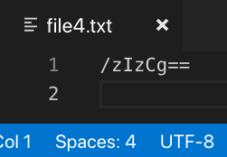
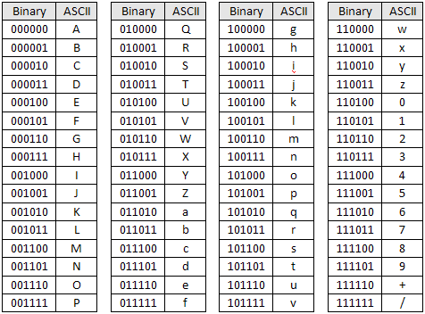

# What is an encoding? Part 2

In part 1 we demystified the following ways the term "encoding" is used:

> This file is hex encoded

> This file uses an ASCII encoding

> This string is Unicode encoded

> Let's write the output to a UTF-8 encoded file

In part 2 we'll address the remaining ways "encoding" might be used:

> Our message is safe because it's encoded using Base64

> Python uses Unicode strings for encoding


---

> ## Our message is safe because it's encoded using Base64

This statement deals with several different concepts. I'll start by going over the different types of encoding.

As best as I can tell there are 2 different types of encodings: [character encodings](https://en.wikipedia.org/wiki/Character_encoding) and [binary-to-text encodings](https://en.wikipedia.org/wiki/Binary-to-text_encoding). ASCII and UTF-8 are examples of character encodings. Base64 is an example of a binary-to-text encoding.

What's the difference? Both character encodings and binary-to-text encodings share the same goal of turning bits into characters. However, character encodings are designed to produce human-readable output. Binary-to-text encodings are designed to turn bits into human-printable output.

Wait, what? That was a nebulous distinction you say? Okay, let me try to explain it in a different way. A character encoding like ASCII is really good for data storage and transmission. For example, say you're writing a speech. You want to save it on your computer so you don't have to re-type it every time. The computer stores that speech as a bunch of `1`s and `0`s. ASCII is needed to translate those bits back into the words, letters, and punctuation that make up the speech. In the same way, say you want to upload the speech to the cloud. The exact same process is needed to transport that speech over the Internet.

Base64 is an example of a binary-to-text encoding. In fact, it's pretty much the only one in use, much like UTF-8 is for character encodings. It is a subset of ASCII, containing 64 of the 128 ASCII characters: `a-z`, `A-Z`, `0-9`, `+`, and `/`. It doesn't contain characters like `NUL` or `EOF`. Those characters are non-printable characters. Base64 is often used to translate a binary file to text, or even a text file with non-printable characters to one with only printable characters. The benefits of this are that you can output the contents of any type of file, no matter what data it contains. It doesn't have to be limited to a file either; it can be just a string, such as a password. Also, you are guaranteed to always have characters that can be displayed, no matter what the underlying bits are. That is something UTF-8 cannot accomplish. How does Base64 do it?

I described in the UTF-8 section how certain bit patterns at the start of a byte indicate how many bytes the character will be. `0` for 1 byte, `110` for 2 bytes, `1110` for 3 bytes, and `11110` for 4 bytes. And it uses `10` to indicate a byte is a continuation byte. This means that byte sequences that don't follow this pattern are incomprehensible to UTF-8. For example, UTF-8 doesn't understand `11111111`.

Let's show this on the command line with a new file, `file3.txt`:

```bash
$ cat file3.txt
123
```
```bash
$ xxd -b file3.txt
00000000: 00110001 00110010 00110011 00001010                    123.
```
```bash
$ printf '\xff' | dd of=file3.txt bs=1 seek=0 count=1 conv=notrunc # overwrite the first byte with 11111111
1+0 records in
1+0 records out
1 byte copied, 0.0009188 s, 1.1 kB/s
```
```bash
$ xxd -b file3.txt
00000000: 11111111 00110010 00110011 00001010                    .23.
```
This is what the file looked like in VSCode using a UTF-8 encoding before being overwritten with the `printf '\xff' | dd...` command:


And this is what it looked like after:


As mentioned before, Base64 can always display printable characters, even when UTF-8 cannot. Let's see that in action:

```bash
$ base64 file3.txt > file4.txt
```

And now the file has printable characters:



Okay, great. But how did we end up with `/zIzCg==`? I'll take this one step at a time to avoid confusion.

Base64 has 64 characters in its alphabet. That means it only needs 6 bits to represent the whole alphabet (2<sup>6</sup> == 64). UTF-8 uses the leading bits in a byte as metadata to determine whether it's a starting byte or a continuation byte. Those bytes don't hold any information about the character being stored (the actual data). In contrast, Base64 uses the entire byte as data. It has no metadata. However, as I mentioned it only uses 6 bits. A byte has 8 bits. How does this math line up?

Let's start by examining the Base64 table, which looks very similar to the ASCII table:



`file3.txt`'s binary representation is `11111111 00110010 00110011 00001010`. The way Base64 works is to interpret the bits in groups of 6. So even though there are 4 groups of 8 bits, we're going to modify the spacing to reflect how Base64 sees this: `111111 110011 001000 110011 000010 10`. In fact, let's look at it in a table format to make things easier:

| Bytes | Base64 character |
| :---: | :---: |
| `111111` | `/` |
| `110011` | `z` |
| `001000` | `I` |
| `110011` | `z` |
| `000010` | `C` |
| `10` | ??? |

The first 5 groupings of 6 bit clumps line up perfectly with the first 5 characters of our Base64 encoded `file4.txt`. But we only have 2 bits remaining at the end. `file3.txt` had 32 bits, which is not divisible by 6. When that happens Base64 resorts to padding. To make a 32 bit file compatible with Base64 we'll append 4 `0`s to the end of the file, making it 36 bits in total. 36 is divisible by 6. Here is the new bit string: `111111 110011 001000 110011 000010 100000`. Let's view it in a table format too:

| Bytes | Base64 character |
| :---: | :---: |
| `111111` | `/` |
| `110011` | `z` |
| `001000` | `I` |
| `110011` | `z` |
| `000010` | `C` |
| `100000` | `g` |

That's much better. Now the first 6 characters match. But what about the `==` at the end? We have no bits remaining. In fact, `=` isn't even in the Base64 table! What gives?

First things first, encoding is not the same as encryption. I guess people confuse the terms because they both start with "enc," and both take plaintext and turn it into gibberish. 

Encoding turns plaintext into seeming gibberish, however, it is intended to be easily turned back into plaintext. 

> ## Python uses Unicode strings for encoding

In python 2 there are a class of string literals that are known as [unicode strings](https://docs.python.org/2/howto/unicode.html#encodings). They are delineated by prefixing the character `u` to a string literal (e.g., `u'abc'`). I am not a fan of the term unicode string because it leads to the confusion that unicode is an encoding. So what exactly does python mean when it refers to unicode strings?

Let's look at some examples in Python 2.7.12:
```python
>>> a = u'abc'
>>> b = u'abcŔŖ'
>>> a
u'abc'
>>> b
u'abc\u0154\u0156'
```
So we define 2 strings, `a` and `b`, which contain the same contents as `file1.txt` and `file2.txt` did. `a` is able to be printed out to the console without an issue, but the console can't render `ŔŖ` at the end of `b`. Instead those characters are replaced with their unicode code points: `\u0154` (`U+0154`) and `\u0156` (`U+0156`). It appears that the python 2 interpreter can only print strings using ASCII, and not a unicode-compatible encoding.

Let's try explicitly encoding these strings:
```python
>>> a.encode('utf-8')
'abc'
>>> a.encode('ascii')
'abc'
>>> b.encode('utf-8')
'abc\xc5\x94\xc5\x96'
>>> b.encode('ascii')
Traceback (most recent call last):
  File "<stdin>", line 1, in <module>
UnicodeEncodeError: 'ascii' codec can't encode characters in position 3-4: ordinal not in range(128)
```
String `a` can be encoded using both ASCII and UTF-8 as expected. Also as expected, encoding string `b` using ASCII results in an error since neither `Ŕ` nor `Ŗ` are ASCII compatible. And encoding string `b` using UTF-8 renders a string that is a mix of ASCII characters (what python 2 can handle) and the hex representations of the non-ASCII characters python 2 couldn't handle.

A unicode string in python 2 is just a combination of ASCII-compatible characters and the code points of non-ASCII compatible characters. What about python 3? Python 3 got rid of the distinction between a regular string (e.g., `abc`) and a unicode string (e.g., `u'abc'`), and just has regular strings without any prefixes. Does this mean there are no unicode strings in python 3?

Let's find out using Python 3.5.2:
```python
>>> a = "abc"
>>> b = 'abcŔŖ'
>>> a
'abc'
>>> b
'abcŔŖ'
```

Python 3 treats every string as a unicode string, and on top of that, can print non-ASCII compatible characters to the console now. Also the `encode()` function still works the same:

```python
>>> b.encode('utf-8')
b'abc\xc5\x94\xc5\x96'
```

The only other question remaining is how to print out the code points?
```python
>>> b.encode('unicode_escape')
b'abc\\u0154\\u0156'
```


## TL;DR
* Don't call hex and binary encodings. They are just different ways to represent the same number.
* ASCII and UTF-8 are encodings. They are the dictionaries that map bits the computer can understand into characters humans can understand.
* Unicode is not an encoding. Technically it is a standard, but I like to think about it as a dictionary for a giant alphabet.
* Encoding `!=` encryption.
* Base64 is not a numeral system like hex or binary. It is an encoding similar to ASCII.
